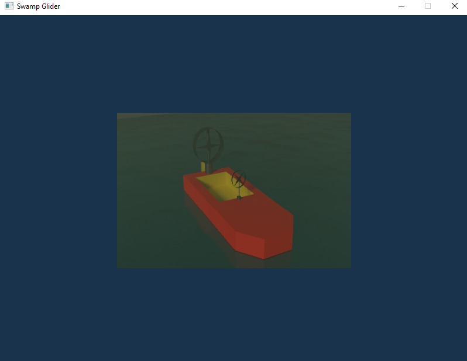

# Projekt GKOM - Ślizgacz bagienny
### Autorzy: Arkadiusz Dawid, Michał Kopyt, Paweł Martyniuk, Adrian Prorok
## Szkic koncepcyjny

## Zrzut ekranu z aktualnej wersji projektu

## Lista zadań
* Model ślizgacza
* Animacja elementów ślizgacza
* Oświetlenie
* Otoczenie
* Ruch

## Wstępne punkty kontrolne
### 0. Wstępna wersja projektu
* Działający szkielet programu
* Plik README.md
* Szkic koncepcyjny ślizgacza
### 1. Prostopadłościan w przestrzeni z nałożoną teksturą
### 2. Dopracowanie szczegółów modelu ślizgacza
### 3. Przygotowanie otoczenia
### 4. Wprowadzenie ruchu oraz animacji do projektu
