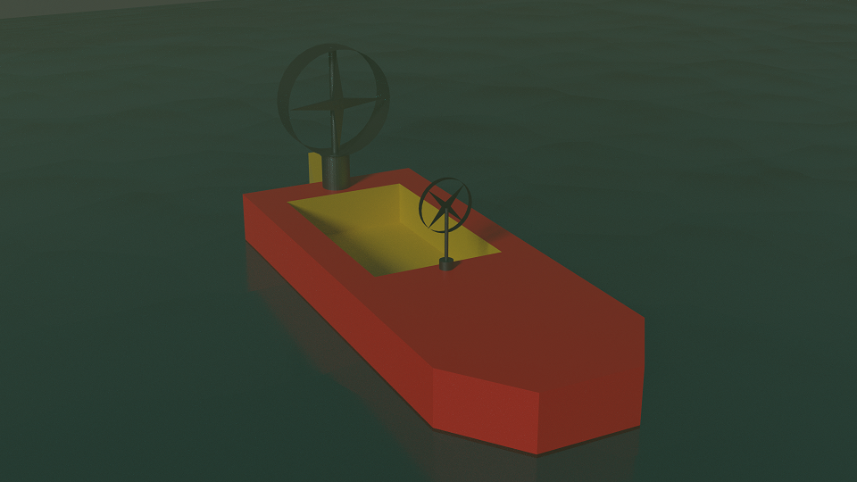
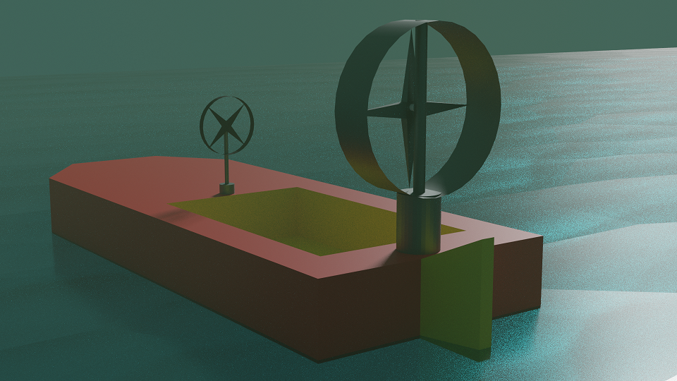
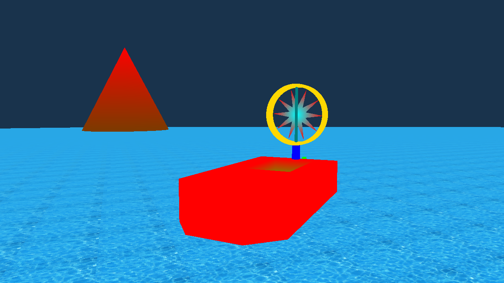

# Projekt GKOM - Ślizgacz bagienny
### Autorzy: Arkadiusz Dawid, Michał Kopyt, Paweł Martyniuk, Adrian Prorok
## Szkic koncepcyjny

## Zrzut ekranu z aktualnej wersji projektu

## Lista zadań
* Model ślizgacza
* Animacja elementów ślizgacza
* Oświetlenie
* Otoczenie
* Ruch

## Punkty kontrolne
### 0. Wstępna wersja projektu
* Działający szkielet programu 
* Plik README.md 
* Szkic koncepcyjny ślizgacza
### 1. Prostopadłościan w przestrzeni z nałożoną teksturą
* Stworzenie prostopadłościanu 
* Dodanie obrotu do prostopadłościanu 
### 2. Dodanie kamery
* Wprowadzenie do projektu kamery oraz jej ruchu
### 3. Tworzenie obiektów
* Stworzenie ogólnej klasy reprezentującej obiekty 
* Wprowadzenie podstawowego kształtu ślizgacza do sceny 
* Dodanie obiektu reprezentującego wodę oraz jego oteksturowanie 
* Dodanie tylnego steru do ślizgacza 
* Dodanie klasy reprezentującej cylider 
* Dostosowanie shaderów do poprawnej obsługi kolorów 
* Dodanie obiektu reprezentującego rurę 
* Dodanie osłony wiatraka oraz podstawki pod osłonę 
* Dodanie wiatraka 
* Wprowadzenie hierarchii obiektów w celu ułatwienia ich rysowania oraz przemieszczania 
* Dodanie kierownicy 
* Wprowadzenie ruchu ślizgacza, wiatraka, kierownicy oraz steru tylnego 
* Dodanie losowego generowania lilii 
### 4. Oświetlenie
