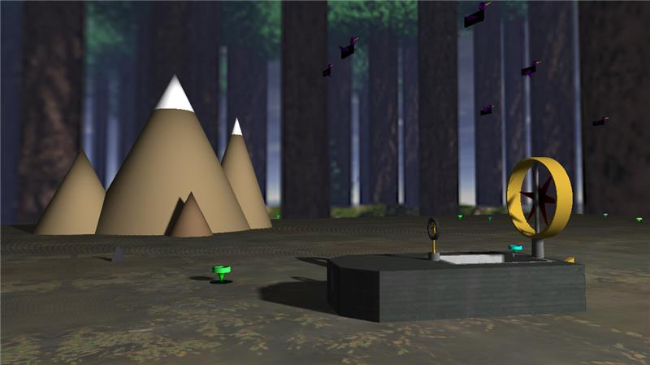

# Projekt GKOM - Ślizgacz bagienny
### Autorzy: Arkadiusz Dawid, Michał Kopyt, Paweł Martyniuk, Adrian Prorok
## Szkic koncepcyjny

## Zrzut ekranu z aktualnej wersji projektu

## Lista zadań
* Model ślizgacza
* Animacja elementów ślizgacza
* Oświetlenie
* Otoczenie
* Ruch

## Punkty kontrolne
### 0. Wstępna wersja projektu
* Działający szkielet programu 
* Plik README.md 
* Szkic koncepcyjny ślizgacza
### 1. Prostopadłościan w przestrzeni z nałożoną teksturą
* Stworzenie prostopadłościanu 
* Dodanie obrotu do prostopadłościanu 
### 2. Dodanie kamery
* Wprowadzenie do projektu kamery oraz jej ruchu
### 3. Tworzenie obiektów
* Stworzenie ogólnej klasy reprezentującej obiekty 
* Wprowadzenie podstawowego kształtu ślizgacza do sceny 
* Dodanie obiektu reprezentującego wodę oraz jego oteksturowanie 
* Dodanie tylnego steru do ślizgacza 
* Dodanie klasy reprezentującej cylider 
* Dostosowanie shaderów do poprawnej obsługi kolorów 
* Dodanie obiektu reprezentującego rurę 
* Dodanie osłony wiatraka oraz podstawki pod osłonę 
* Dodanie wiatraka 
* Wprowadzenie hierarchii obiektów w celu ułatwienia ich rysowania oraz przemieszczania 
* Dodanie kierownicy 
* Wprowadzenie ruchu ślizgacza, wiatraka, kierownicy oraz steru tylnego 
* Dodanie losowego generowania lilii 
* Dodanie skyboxa 
* Dodanie ptaków
* Dodanie gór
* Teksturowanie ślizgacza oraz bagna
* Przygotowanie obrazków do skyboxa
* Dodanie rekina
### 4. Oświetlenie
* Zmiany w shaderach (dodanie oświetlenia)
* Ustawienie normalnych we wszystkich obiektach
* Zmiany w shaderach (dodanie cieni)
* Dostosowanie programu tak, aby oświetlenie oraz cienie działały poprawnie

## Sterowanie w programie
* **strzałki** - sterowanie ślizgaczem (przód, tył, lewo, prawo)
* przycisk **T** - turbo do ślizgacza
* **W, S, A, D, myszka** - sterowanie kamerą (przód, tył, lewo, prawo)
* przyciski **1 oraz 2** - przyspieszenie ruchu kamery (do przodu i do tyłu)
* **Q, E** - poruszanie kamerą (góra, dół)
* **I, K, J, L** - sterowanie źródłem światła (przód, tył, lewo, prawo)
* **O, U** - poruszanie źródłem światła (góra, dół)
* **Z, X, C, V, Z + X, Z + C, X + C** - zmiana koloru światła (Z - czerwony, X - zielony, C - niebieski, V - biały)

## Dostępne stałe, które można zmieniać
* liczba lilii
* liczba ptaków
* liczba skrzydeł wiatraka w ślizgaczu
* dokładność rysowania kształtów owalnych
* wysokość lotu ptaków
* początkowa pozycja i kolor światła